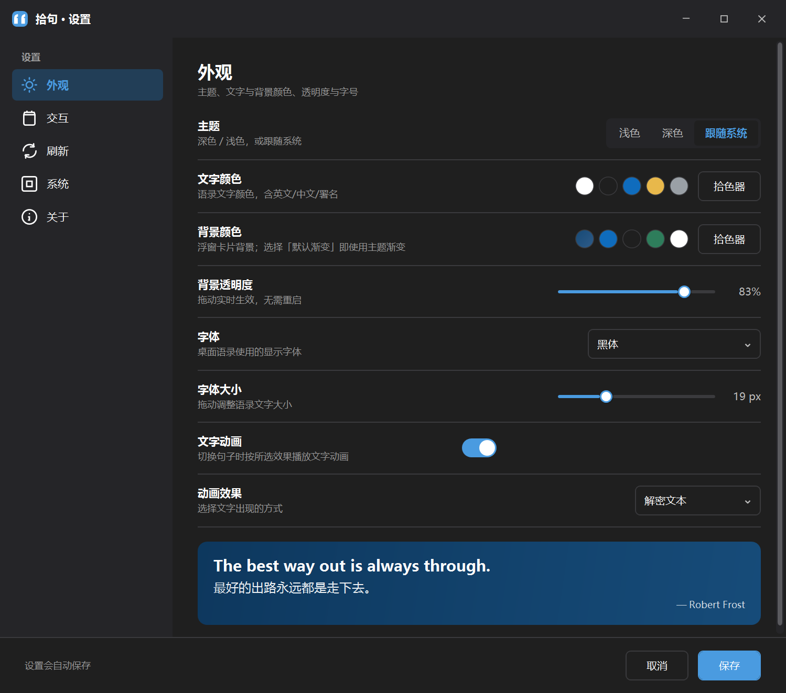

# 拾句（Daily Quote）

> 桌面壁纸层每日金句浮窗 · 基于 .NET 9 + WPF 构建

拾句是一个 Windows 桌面小部件：在桌面壁纸层常驻显示每日英文金句 + 中文翻译 + 作者，支持多种文字动画、透明度 / 字号 / 颜色自定义、开机自启、随机 / 刷新、一键复制到剪贴板。

单文件自包含发布，目标机无需安装 .NET 运行时。

## 功能特性

- 桌面壁纸层浮窗（沉于图标之下，不抢焦点）
- 四种文字动画：打字机 / 解密文本 / 文本生成效果 / 文本上浮（可关闭直接显示全文）
- 透明度、字号、字体、文字颜色、背景色自定义
- 浅色 / 深色 / 跟随系统 三套主题
- 拖拽移动 + 位置记忆
- 单击 / 双击动作可配置（随机换句 / 打开设置 / 复制 / 无）
- 定时刷新（1–1440 分钟）+ 每日 0 点自动更新
- 开机自启（可选）
- 系统托盘图标，崩溃日志
- 一键复制：`"英文" —— 作者｜中文`

## 下载与安装

1. 获取安装包 `拾句_setup.exe`（约 48MB，LZMA 压缩的自包含安装包）。
2. 双击运行，可选择安装目录（默认 `%LOCALAPPDATA%\Programs\拾句`；选择 `Program Files` 会请求管理员提权）。
3. 可选创建桌面快捷方式、启用开机自启。
4. 安装完成后，桌面壁纸层即出现浮窗，通知区出现托盘图标。

> 数据存储在 `%APPDATA%\拾句\`（语料 `data.json` 与设置 `settings.json`）。

## 使用说明

- **浮窗**：常驻桌面壁纸层，显示当日金句。拖拽可移动，位置自动记忆。
- **托盘图标**：双击打开设置，右键菜单含「打开设置 / 退出」。
- **右键菜单（浮窗上）**：刷新 / 复制 / 设置 / 锁定位置 / 退出。
- **设置**：外观（主题、颜色、透明度、字体字号、动画效果，实时预览）、交互（单击双击动作）、刷新（间隔、立即更新）、系统（开机自启）、数据（手动更新语料）。
- **复制**：将当前金句复制到剪贴板，格式 `"英文" —— 作者｜中文`。

## 截图

桌面浮窗效果：

设置界面外观：

## 许可与作者

- 个人 / 内部项目，未声明第三方开源许可。
- 图标复用自早期 Tauri 方案的 `src-tauri/icons/icon.ico`。
- 语料种子来自扇贝「每日一句」公开内容，仅供学习展示。

## 开发者文档

架构、打包、数据模型与已知问题见 [DEVELOPMENT.md](./DEVELOPMENT.md)。
